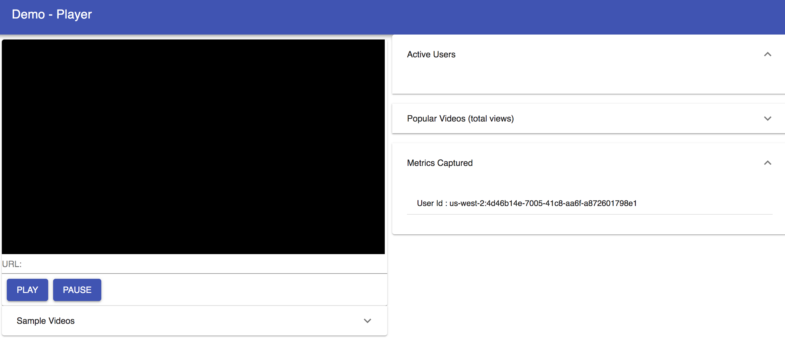

# JavaScript Player with Analytics

- [JavaScript Player with Analytics](#JavaScript-Player-with-Analytics)
  - [Overview](#Overview)
  - [JavaScript video player embedding](#JavaScript-video-player-embedding)
  - [Demo Player](#Demo-Player)

## Overview

In order to gain the benefits and see the analytics data in Athena and Quicksight a special player SDK has to be used. This additional player pluging send anonymous data about https errors, latency, and other metrics that the VideoJs player emitts. This data gets sent to AWS into Kinesis Firehouse and get put into S3 where Athena and Quicksight can access these metrics for watching and running analysis.

## JavaScript video player embedding

There is a vanilla JavaScript player as well as a ReactJS player that you can use on your website or application. The JavaScipt player can be modified in order to work in your application.

The code can be found under the web directory of the repo. 

## Demo Player

The demo player shown below can be used to test this solution. The demo player is deployed via the CloudFormation interface and gives a demo that includes the HLS player as well as the metrics getting sent into the interface. The workshop shows how to use this demo player. 

