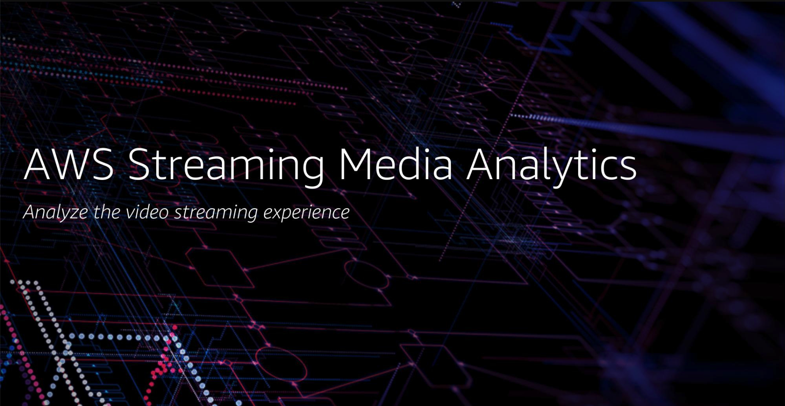
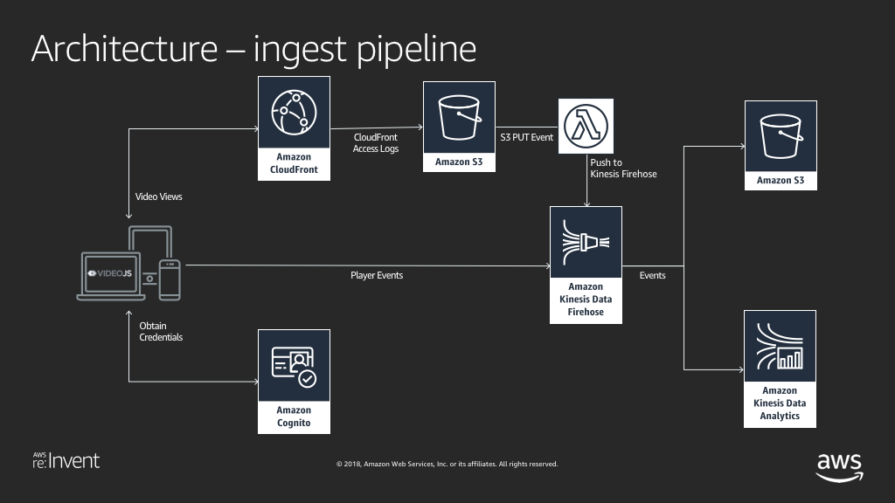
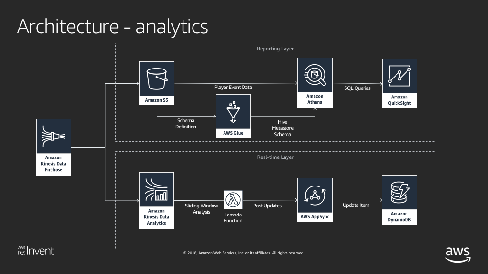
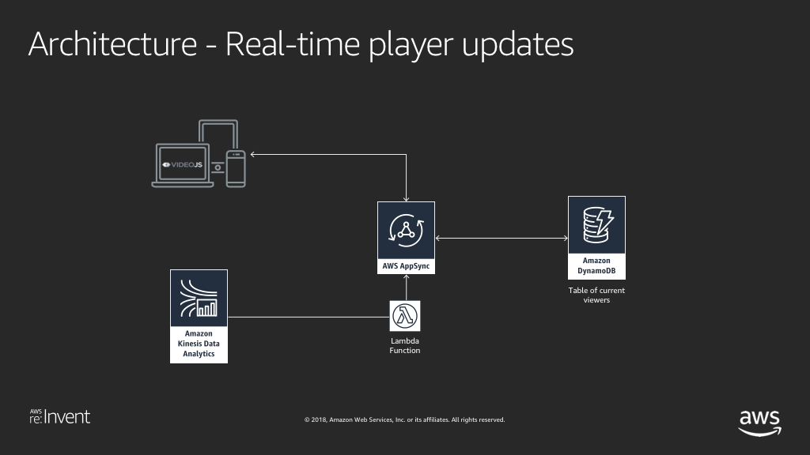

# AWS Streaming Media Analytics

AWS Streaming Media Analytics is a serverless end-to-end solution for analyzing the video streaming experience

- [AWS Streaming Media Analytics](#AWS-Streaming-Media-Analytics)
  - [Launching from a Pre-Built template](#Launching-solution-with-Pre-built-AWS-CloudFormation-Template)
  - [Reinvent Workshop](#Reinvent-Workshop)
  - [Solution Architecture](#Solution-Architecture)
  - [How to customize and create your own CloudFormation template.](#How-to-customize-and-create-your-own-CloudFormation-template)
  - [JavaScript Video Player Setup](#JavaScript-Video-Player-Setup)
  - [License Summary](#License-Summary)





## Launching solution with Pre-built AWS CloudFormation Template

The solution is deployed using an AWS CloudFormation template with AWS Lambda backed custom resources. To deploy the solution, use one of the following CloudFormation templates and follow the instructions below.

| AWS Region | AWS CloudFormation Template URL |
|:-----------|:----------------------------|
| ap-northeast-1 (Tokyo) |<a href="https://console.aws.amazon.com/cloudformation/home?region=ap-northeast-1#/stacks/new?stackName=mediaqos&templateURL=https://s3.amazonaws.com/aws-streaming-media-analytics-workshop-ap-northeast-1/qos/cloudformation/oss-v1.1.3/deployment.yaml" target="_blank">Launch stack</a> |
| ap-northeast-2 (Seoul) |<a href="https://console.aws.amazon.com/cloudformation/home?region=ap-northeast-2#/stacks/new?stackName=mediaqos&templateURL=https://s3.amazonaws.com/aws-streaming-media-analytics-workshop-ap-northeast-2/qos/cloudformation/oss-v1.1.3/deployment.yaml" target="_blank">Launch stack</a> |
| ap-south-1 (Mumbai) |<a href="https://console.aws.amazon.com/cloudformation/home?region=ap-south-1#/stacks/new?stackName=mediaqos&templateURL=https://s3.amazonaws.com/aws-streaming-media-analytics-workshop-ap-south-1/qos/cloudformation/oss-v1.1.3/deployment.yaml" target="_blank">Launch stack</a> |
| ap-southeast-1 (Singapore) |<a href="https://console.aws.amazon.com/cloudformation/home?region=ap-southeast-1#/stacks/new?stackName=mediaqos&templateURL=https://s3.amazonaws.com/aws-streaming-media-analytics-workshop-ap-southeast-1/qos/cloudformation/oss-v1.1.3/deployment.yaml" target="_blank">Launch stack</a> |
| ap-southeast-2 (Sydney) |<a href="https://console.aws.amazon.com/cloudformation/home?region=ap-southeast-2#/stacks/new?stackName=mediaqos&templateURL=https://s3.amazonaws.com/aws-streaming-media-analytics-workshop-ap-southeast-2/qos/cloudformation/oss-v1.1.3/deployment.yaml" target="_blank">Launch stack</a> |
| eu-west-1 (Dublin) |<a href="https://console.aws.amazon.com/cloudformation/home?region=eu-west-1#/stacks/new?stackName=mediaqos&templateURL=https://s3.amazonaws.com/aws-streaming-media-analytics-workshop-eu-west-1/qos/cloudformation/oss-v1.1.3/deployment.yaml" target="_blank">Launch stack</a> |
| eu-west-2 (London) |<a href="https://console.aws.amazon.com/cloudformation/home?region=eu-west-2#/stacks/new?stackName=mediaqos&templateURL=https://s3.amazonaws.com/aws-streaming-media-analytics-workshop-eu-west-2/qos/cloudformation/oss-v1.1.3/deployment.yaml" target="_blank">Launch stack</a> |
| us-east-1 (N. Virginia) |<a href="https://console.aws.amazon.com/cloudformation/home?region=us-east-1#/stacks/new?stackName=mediaqos&templateURL=https://s3.amazonaws.com/aws-streaming-media-analytics-workshop-us-east-1/qos/cloudformation/oss-v1.1.3/deployment.yaml" target="_blank">Launch stack</a> |
| us-east-2 (Ohio) |<a href="https://console.aws.amazon.com/cloudformation/home?region=us-east-2#/stacks/new?stackName=mediaqos&templateURL=https://s3.amazonaws.com/aws-streaming-media-analytics-workshop-us-east-2/qos/cloudformation/oss-v1.1.3/deployment.yaml" target="_blank">Launch stack</a> |
| us-west-2 (Oregon) |<a href="https://console.aws.amazon.com/cloudformation/home?region=us-west-2#/stacks/new?stackName=mediaqos&templateURL=https://s3.amazonaws.com/aws-streaming-media-analytics-workshop-us-west-2/qos/cloudformation/oss-v1.1.3/deployment.yaml" target="_blank">Launch stack</a> |

This CloudFormation template deploys an example OTT streaming platform in to your AWS account. The deployed environment includes a static website hosted on S3 with sample videos, Kinesis Data Firehose endpoints to accept and process streaming log data and a real-time log analysis application built on Kinesis Analytics, DynamoDB and AppSync.

If you want to make changes to the code change the S3Bucket field in the mapping section of the CloudFormation document to your own bucket. Make sure to put the lambda code in the region you want to deploy. 

1. Click on one of the links above to deploy the solution via CloudFormation in your AWS account. 

2. The CloudFormation Management Console will load with the template URL pre-filled as a Amazon S3 URL. Click the orange Next button located in the bottom right corner of the console to configure the deployment.

3. By default we have set a stack name of mediaqos. There is no need to change this and we refer to this name throughout the guide when identifying resources. If you do decide to change the stack name, please ensure you only use lower-case letters and digits, and keep the name under 12 characters. The stack name is used to name resources throughout the workshop. Keep the name handy as you will need it from time to time to locate resources deployed by the stack.

4. Once you have decided on a stack name, click Next to continue.

5. On the next step, Configure stack options, leave all values as they are and click Next to continue.

6. On the Review step

a. Check the three boxes under Capabilities and transforms to acknowledge the template will create IAM resources and leverage transforms.

b. Click the Create stack button located at the bottom of the page to deploy the template.

The stack should take around 5-10 minutes to deploy.

## Quicksight Update Frequency

By default the Glue Trigger is set for every 4 hours to reduce cost. This can frequency can be increased, but check the AWS Glue console pricing for more details. In my testing AWS Glue cost 0.44 cents per run in this solution. 

The GlueJob that writes player data to S3 for Athena and Quick sight is located within the WatchTimeGlueTrigger. Look for the field that looks like this. 
```Schedule: cron(0 */4 * * ? *)```


## Reinvent Workshop

This solution was originally developed for a workshop at AWS re:Invent 2018. An updated version of the lab guides from this workshop are available at the following link: [AWS Streaming Video Analytics Workshop](https://streamingvideoanalytics.workshop.aws/)

## Architecture 









## How to customize and create your own CloudFormation template.

Setup Instructions
To build with Docker && make

Pre-requisites:
- Install `docker` for your environment as we will use a Docker container to build
- Install AWS CLI
- Install yarn

The build and deployment process for this project has been tested on both Mac and Linux using the vscode and Cloud9 IDEs respectively. 

Build Configuration:

Copy the Makefile.sample file to a file named Makefile. In the new file:
  - set `bucket` variable to reflect the S3 bucket name prefix which will be created within a deployment region. Note the region name will be appended to this prefix.
  - optionally, set the `s3prefix` variable to a prefix you wish to prepend to the path of all artifacts put into the S3 bucket(s).
  - set `regions` variable to reflect one or more AWS regions you want the code artifacts to be copied for CloudFormation deployment.
  - set `stack_name` for the Stack Name to use in the deployment.
  - set `profile` to the AWS CLI profile which has necessary permissions to deploy and create all the resources required.

Commands to manage creation/deletion of S3 buckets:
- To create buckets across regions: `make creates3`
- To delete buckets across regions: `make deletes3`

Commands to build and deploy the entire project
- `make all`
- `make deploy`

Once the deployment is done you should see the player URL in the Outputs section of the CloudFormation template.

## Pricing

Reference the AWS Pricing pages for each service used. 


## JavaScript Video Player Setup

[Guide to Setup JavaScript Video Player](PLAYERSETUP.md)


## License Summary

This sample code is made available under the MIT-0 license. See the LICENSE file.
